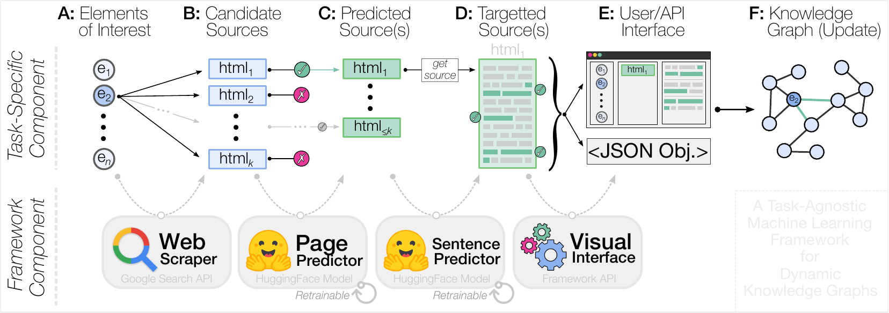

#  A Task-Agnostic Machine Learning Framework for Dynamic Knowledge Graphs

*Source Repository for the CASCONxEVOKE 2022 Paper*

Quick, high-level framework to design, train and use a machine learning model for textual analysis and arbitrary fact determination.
Created using [PyTorch](https://pytorch.org/), [scikit-learn](https://scikit-learn.org/) and [🤗Transformers](https://huggingface.co/).

## About

This repository is part of a submission to the CASCONxEVOKE 2022 conference. As such, it has been uploaded anonymously to GitHub with heavily squashed commits. A full version of this framework will be uploaded after the submission period for the conference.

## Features

This repository provides an end-to-end method to generate supervised learning models from a basic YAML configuration file.

- Template engine generates search queries for automatic online data gathering
- Simple structure used to define data attributes to train models on and recognize in data
- Set up templates to assist in data labelling for supervised learning
- Structure to direct inputs/outputs between models to maximize accuracy and performance

## Installation

### Requirements

* [Python 3](https://www.python.org/) (Tested on 3.7, 3.8)
* Recommended:
    * NVIDIA GPU installed
    * [NVIDIA CUDA Toolkit](https://developer.nvidia.com/cuda-toolkit) for GPU hardware acceleration when using ML
      models

Install Python packages

```bash
python -m pip install -r requirements.txt
```

## Initialization


### Dataset Creation

Create a new CSV file or edit `data/raw/sample_manufacturers.csv`. This file contains a single column with a column name and a list of entities.
These entities will be fed into search query templates to generate search queries to scrape information from.
Change the values in this csv file to match your desired entity names.
If you made a new CSV file, change the path of `paths.entities` in `src/config/config.yml`.

In `src/config/config.yml`, change the `collection.templates` list to a list of templates in which entity names will be injected. The `{}` token will be replaced with the entity name at search time.

Edit the `data.attributes` property with a list of attributes to apply to each point of data (pages or sentences).
The property name represents the name of the column to be added to the SQLite table upon initialization. 
`desc` contains a description of the attribute.

Run `src/data/make_dataset.py`.
The script will create the SQLite database based on the specified configuration parameters and begin populating it with unlabelled data from web searches.

### Page-Level Labelling

Open `src/config/config.yml` and edit `tagging.options`. This property contains a list of options for use when labelling data. Assign a `name` and `values` property for each option, with `values` containing a list of values to be applied to each row when it is labelled, in the order they are listed in `data.attributes`.

Run `src/features/tagging_utility.py` and enter `p` to begin labelling "page" data.

Marking labelling pages will populate the database for sentence-level labelling with
unlabelled sentences pulled from the webpages within the page database.

### Sentence-Level Labelling

Run `src/features/tagging_test.py` and enter `s` to begin labelling "sentence" data.

From here, you will be able to label sentences in the same way as pages.

### Training

Run `src/models/train/train_page_level_classifier.py` and `src/models/train/train_sentence_level_classifier.py` to train
the classifiers for page-level and sentence-level prediction using the labelled data.

## Usage

Once you have trained models in your `models` folder, you can start using the program to examine live data from the internet.

Create a `.csv` file in the `data/raw` directory with a single column with a name of your choice. Add a list of entities to search for, separated by newlines.

Open the import script at `src/models/predict/real_world_detection.py` and change `MAIN_RAW_DATA_PATH` to the path to
your CSV file.

Once your CSV file has been created, run the import script. This script will read company names from the CSV file and start the search, scrape and extract process on each entity. This process will take some time.

## Credits

This project was designed and created by an anonymous group for the CASCONxEVOKE 2022 conference. Credits will be released with the full publication of this project.